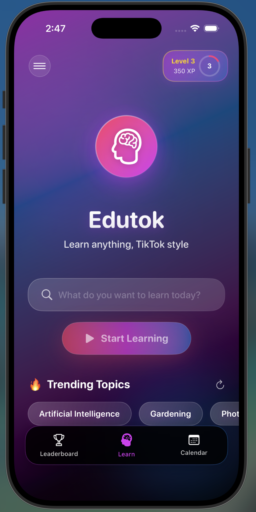
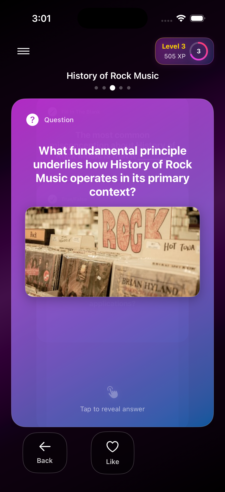
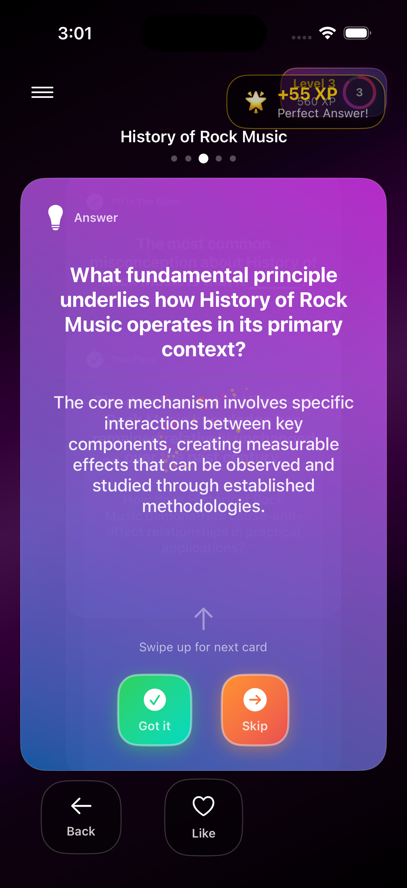
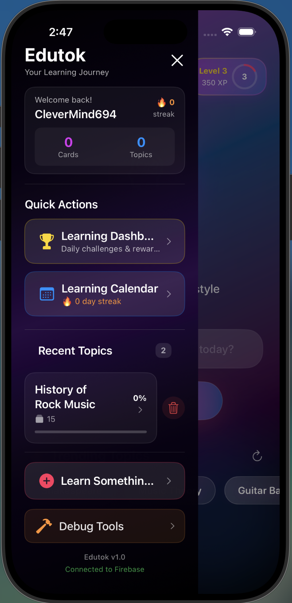
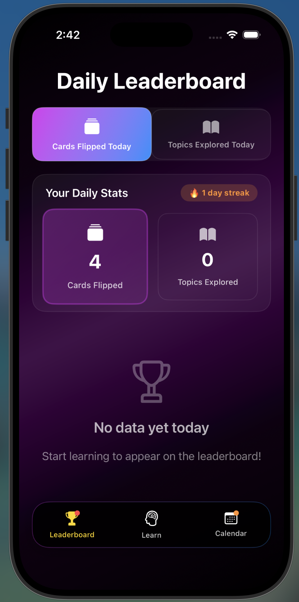
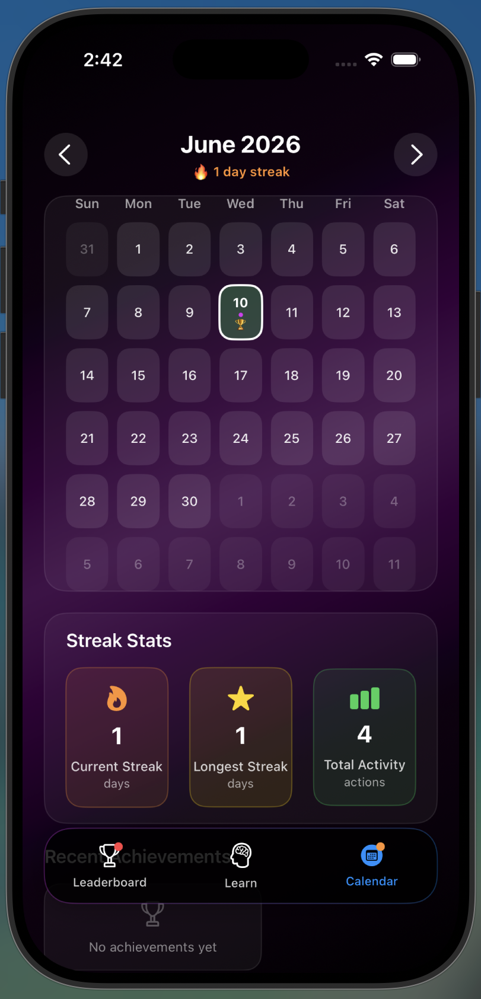

# Edutok

**Learn anything, one swipe at a time.**

Edutok is an iOS app that turns any topic into a TikTok-style feed of bite-sized, AI-generated flashcards — wrapped in streaks, achievements, and a leaderboard to make learning genuinely addictive.

<p align="center">
  
</p>

[](https://github.com/billdmar/Edutok/actions/workflows/ci.yml)


---

## Features

- **AI flashcard generation** — Enter any topic and Google Gemini produces an endless feed of concise, accurate facts and questions.
- **Swipeable feed** — A vertical, full-screen card feed inspired by short-form video apps.
- **Rich imagery** — Each card is paired with a relevant photo fetched from Unsplash.
- **Saved cards** — Swipe left to bookmark a card, then review all your saved cards in one place.
- **Self-graded recall** — Reveal a card, then rate yourself "Got it" or "Again". Correct recall earns the XP (with a first-try perfect bonus + speed bonus); "Again" resurfaces the card sooner. XP reflects learning, not just flipping.
- **Spaced-repetition review** — Cards you mark understood resurface on a widening schedule (1 → 3 → 7 → 14 → 30 days); cards you miss come back immediately.
- **Topic search & history** — Search every topic you've studied and resume it with one tap.
- **Share a card** — Send any flashcard's question + answer to friends.
- **Accounts & sync** — Anonymous, email/password authentication and cloud data sync via Firebase.
- **Settings** — Edit your username, review your stats, sign out, or delete your account and data.
- **Gamification** — Daily streaks, XP and levels, unlockable achievements, daily challenges, mystery boxes, and particle-effect celebrations. ([design notes](docs/gamification-design.md))
- **Leaderboard** — Compete with other learners on a global leaderboard.
- **Streak calendar** — Visualize learning consistency over time.
- **Local notifications** — Reminders to keep your streak alive.
- **Accessibility** — Respects Reduce Motion, labels controls for VoiceOver (the swipe-feed
  actions are exposed as VoiceOver actions so the feed is fully navigable without sight),
  scales text with Dynamic Type, and uses ≥44 pt tap targets.
- **Smooth image feed** — Card photos are cached as decoded images, so scrolling back to a
  card reuses it instead of re-downloading.

## Tech stack

| Area            | Technology                            |
| --------------- | ------------------------------------- |
| UI              | SwiftUI (iOS 18.5+)                   |
| Language        | Swift 5 / Xcode 16                    |
| AI content      | Google Gemini (`gemini-1.5-flash-latest`)    |
| Images          | Unsplash API                          |
| Auth & database | Firebase Auth + Cloud Firestore       |
| Architecture    | MVVM with `ObservableObject` managers — see [docs/ARCHITECTURE.md](docs/ARCHITECTURE.md) |

## Architecture

State is owned by a set of `@MainActor` `ObservableObject` managers, each responsible for one domain, and injected into the SwiftUI view tree:

- **`TopicManager`** — requests flashcards from Gemini and caches generated topics.
- **`ImageManager`** — resolves and caches Unsplash imagery for each card.
- **`FirebaseManager`** — authentication and Firestore reads/writes.
- **`GamificationManager`** — streaks, XP, achievements, challenges, and notifications.

A small `GeminiClient` networking layer centralizes the Gemini endpoint, model id, and
response decoding (shared by `TopicManager` and `ImageManager`), and `StreakCalculator`
holds the streak math as a pure, unit-tested function.

```
Edutok/
├── App.swift                  # App entry point
├── ContentView.swift          # Root view & routing
├── MainView.swift             # Primary flashcard feed
├── FlashcardView.swift        # Individual card UI
├── TopicManager.swift         # Gemini flashcard generation
├── ImageManager.swift         # Unsplash image fetching
├── FirebaseManager.swift      # Auth & Firestore access
├── GamificationManager.swift  # Streaks, XP, achievements
├── *CalendarView.swift        # Streak calendar views
├── LeaderboardView.swift      # Global leaderboard
└── Models.swift               # Core data models
```

## Engineering decisions

A few choices worth calling out:

- **Domain-driven `@MainActor` managers instead of one massive view model.** State is
  split across `TopicManager`, `ImageManager`, `FirebaseManager`, and `GamificationManager`
  — each owns a single domain and is injected into the SwiftUI tree. All are `@MainActor`,
  so published state mutates on the main thread and the UI updates without data races. This
  keeps each concern isolated and made the gamification logic unit-testable on its own.
- **Resilient AI integration.** Flashcards come from Google Gemini (`gemini-1.5-flash-latest`)
  over its REST endpoint via a small `GeminiClient` networking layer (one place for the URL,
  model id, status checking, and decoding — shared with image-keyword generation). Cards are
  generated in **batches of 15** with a prompt whose depth and topic aspect vary by batch
  number, so an "endless" feed keeps getting deeper instead of repeating. Because LLMs wrap
  JSON in markdown fences and prose, the raw response is sanitized (`LLMJSON.extractJSONArray`,
  unit-tested) before decoding into typed `Codable` structs. A typed `APIError` distinguishes
  transport, HTTP-status, and decode failures, and any failure falls back to deterministic
  mock cards, so the feed is never empty and the app degrades gracefully offline.
- **Gamification modeled as pure, testable logic.** Leveling uses an explicit quadratic XP
  curve — `((n-1)² · 50) + ((n-1) · 50)` XP to reach level _n_ (so L2 = 100, L3 = 300,
  L4 = 600). `UserProgress.addXP` is a pure mutating function that returns whether the user
  leveled up, which drives the celebration animation. Mystery-box rewards use a deliberate
  variable-ratio schedule (50% common / 30% rare / 15% epic / 5% legendary) — a real
  behavioral-design choice, documented in [docs/gamification-design.md](docs/gamification-design.md).
- **Why SwiftUI + Firebase.** SwiftUI for declarative, animation-rich UI (the swipe feed and
  particle effects); Firebase Auth + Firestore for zero-backend auth, cross-device sync, and
  the global leaderboard without standing up a server.

## Testing

Core domain logic is covered by **68 unit tests** in `EdutokTests`, exercising the pure,
Firebase-free logic independently of the UI:

- **XP / leveling** — thresholds, level-up detection, in-level progress.
- **Streaks** (`StreakCalculator`) — single-day vs. consecutive-day runs, gap resets, and the
  regression test that many same-day events advance the streak by **one**, not N.
- **Spaced repetition** (`ReviewScheduler`) — due/not-due across the interval schedule.
- **Leaderboard ranking** — descending sort, 1-based ranks, current-user flagging.
- **Networking** (`GeminiClient`) — success, HTTP-error, empty-response, and decode-failure
  paths, exercised against a `URLProtocol` stub (no real network).
- **LLM JSON sanitization** (`LLMJSON.extractJSONArray`) — markdown-fence stripping,
  prose-wrapped responses, smart-quote normalization.
- **Backward-compatible decoding**, mystery-box reward ranges, and topic-progress percentages.

Plus an offline **XCUITest smoke suite** (`EdutokUITests`) — launch, the topic → flashcard
happy path (mock deck, no network), the sidebar, and nav-bar section switching — run as a
separate CI job. Style is enforced by **SwiftLint** (config tuned for SwiftUI; its own CI job).

Run them with:

```bash
xcodebuild test -scheme Edutok \
  -destination 'platform=iOS Simulator,name=iPhone 16 Pro' \
  -only-testing:EdutokTests
```

## Getting started

### Prerequisites

- Xcode 16 or later
- An iOS 18.5+ simulator or device
- API keys for Google Gemini and Unsplash
- A Firebase project (iOS app)

### Setup

1. **Clone the repo**
   ```bash
   git clone https://github.com/billdmar/Edutok.git
   cd Edutok
   ```

2. **Add your API keys.** Create `Edutok/Secrets.swift` (gitignored — never committed):
   ```swift
   import Foundation

   enum Secrets {
       static let geminiAPIKey = "YOUR_GEMINI_API_KEY"
       static let unsplashAccessKey = "YOUR_UNSPLASH_ACCESS_KEY"
   }
   ```
   - Gemini key: https://aistudio.google.com/app/apikey
   - Unsplash key: https://unsplash.com/oauth/applications

3. **Add Firebase config.** Download your own `GoogleService-Info.plist` from the
   [Firebase Console](https://console.firebase.google.com/) and drop it in `Edutok/`
   (also gitignored).

4. **Open and run**
   ```bash
   open Edutok.xcodeproj
   ```
   Select a simulator and press **⌘R**.

## Security

See [SECURITY.md](SECURITY.md) for the full model. In short:

- API keys live in `Edutok/Secrets.swift` (**gitignored**); the Firebase
  `GoogleService-Info.plist` is **gitignored** and supplied per-developer. No secrets are
  committed anywhere in the repository or its history (CI builds against non-functional stubs).
- [`firestore.rules`](firestore.rules) constrains every Firestore write to the authenticated
  owner — a user can only edit their own profile and can't post a leaderboard score under
  another user's id, closing the cross-user spoofing hole.
- App Transport Security uses defaults (TLS 1.2+ with forward secrecy); no ATS exceptions.
- Because the app has no backend, the embedded API keys are extractable from the binary — a
  documented limitation whose natural fix is a server-side proxy (SECURITY.md explains why the
  manager architecture makes that a localized change).

## Screenshots

| Home & topic search | Flashcard question | Answer & level-up |
| :--: | :--: | :--: |
|  |  |  |

| Learning journey | Daily leaderboard | Streak calendar |
| :--: | :--: | :--: |
|  |  |  |

## Roadmap

- [x] AI flashcard generation, swipe feed, gamification, global leaderboard
- [ ] Study groups & social features
- [ ] Skill trees / topic specializations
- [ ] On-device personalization of card difficulty

See the [gamification design notes](docs/gamification-design.md) for the full plan.

## License

Released under the [MIT License](LICENSE).
